# 5 CPU–GPU Cooperative Incremental Graph Computation

Regional updates can affect only part of a graph, yet worklist construction, data transfer, and topology maintenance may still involve unaffected vertices. We reduce this overhead through CPU–GPU cooperative incremental computation. Section 5.1 uses GPU-identified affected vertices to guide parallel CPU preparation and GPU deletion repair. Section 5.2 publishes changed topology and propagates insertion effects only from vertices whose distances improve. Section 5.3 reduces repeated propagation and large-batch preparation costs.

## 5.1 Affected-Region Detection and Cooperative Repair

We describe the process using SSSP with positive edge weights; BFS uses unit weights. For a batch of effective deletions $D_t$ and insertions $I_t$, let $G_t=(V,E_t)$ be the previous graph, $G_{t+1}^{-E}=(V,E_t\setminus D_t)$ the graph after deletion, and $G_{t+1}^{+E}=(V,(E_t\setminus D_t)\cup I_t)$ the final graph. The system completes deletion repair before processing insertions. Figure 3 follows this order: ①–③ perform deletion detection and repair (§5.1), followed by topology publication and insertion propagation in ④–⑥ (§5.2).

**① Identifying invalid results.** For a deleted edge $(u,v)$, the GPU checks whether $u$ is the stored parent of $v$, indicating that the recorded path to $v$ uses this edge. If so, it marks $v$ for repair; because other vertices may depend on $v$, the GPU then checks vertices depending on those newly marked in each round, repeating this process on the old graph until no further invalid vertices are found. Distance checks also account for shortest-path dependencies when a stored parent no longer supports the current distance. We denote the vertices identified for repair by $A$, the affected set. Identifying vertices through stored dependencies is a common step in incremental graph computation.[^gpu-incremental]

Worklist-based execution collects vertices to process in each iteration. However, constructing these lists can require examining many unaffected vertices: the local Grapin implementation scans vertex flags across all graph partitions to rebuild deletion worklists after each propagation round.[^gpu-incremental] This preparation does not exploit the regionality of the detected changes. We instead append a vertex ID to a compact queue as soon as the vertex is first marked for repair. Each round processes only the IDs appended in the preceding round and adds newly identified vertices to the same queue, avoiding repeated graph-wide scans to collect them. Once no new vertices are found, the queue contains $A$. The GPU resets their distances and tentative values to $\infty$, retains the fixed source at zero, and sends the queued IDs to the CPU to prepare their remaining incoming edges. Thus, the vertices discovered during invalidation directly determine the repair inputs, without gathering all vertex values or reconstructing partition worklists.

**② Preparing the remaining dependencies.** Invalidating a result does not reveal every path that can restore it. For example, deleting $(u,v)$ may invalidate $v$, while a remaining edge $(x,v)$ provides an alternative path from an unaffected vertex $x$. Since $d(x)$ does not change, propagation triggered only by distance improvements would not expand $x$ to recover $v$; a batch without insertions makes this omission particularly clear. After applying the effective deletions, the CPU therefore uses the updated reverse index (§4.3) to retrieve the remaining predecessors of every destination in $A$:

\[
I(A)=\{(u,v)\in E(G_{t+1}^{-E})\mid v\in A\}.
\tag{5.1}
\]

For each requested destination, the CPU merges its sorted incoming base list with its sorted delta records and emits the sources whose remaining multiplicity is positive. Thus, the index exposes both boundary edges from outside $A$, such as $(x,v)$, and edges within $A$ through which restored distances can propagate. The CPU packs these dependencies into row offsets and source IDs and transfers them to the GPU. This makes alternative paths available without scanning all outgoing lists to discover predecessors, copying the distance arrays to the CPU, or maintaining a complete reverse graph on the GPU. Reverse-index maintenance itself consumes the effective changes from topology updates; querying $I(A)$ does not rebuild that index.

**Parallel CPU preparation in ②.** The CPU uses persistent worker pools to process independent source lists during topology mutation and independent destination groups during reverse-index maintenance and incoming-row preparation. For a sufficiently large $A$, workers dynamically claim tiles of affected destinations, merge each tile's base and delta lists into private buffers, and then copy these buffers in parallel to disjoint positions determined by a prefix sum. This arrangement distributes dependency preparation across CPU cores, avoids contention on a shared append buffer, and scans each requested base/delta row only once instead of repeating the merge to size and fill the output.

**③ Repairing distances on the GPU.** The prepared rows let the GPU combine unchanged boundary distances with restored values inside $A$. For $v\in A$, it repeatedly applies

\[
d(v)\leftarrow\min\left\{d(v),
\min_{(u,v)\in I(A)}[d(u)+w(u,v)]\right\},
\tag{5.2}
\]

until no distance changes, where the minimum over an empty predecessor set is $\infty$. A warp cooperatively scans an incoming row and reduces its candidate distances. Boundary edges supply valid starting values, and subsequent rounds propagate them through internal edges. For example, if $d(x)=4$ and $w(x,v)=1$, the prepared row restores $d(v)$ to 5; an affected successor $z$ with $w(v,z)=1$ can then recover to 6. The CPU controls ordinary repair rounds by checking a change flag, while distance comparisons and updates remain on the GPU.

Repair requires invalidation to include every vertex whose distance needs correction, leaving valid distances outside $A$. Under this condition, every finite candidate extends a valid path in $G_{t+1}^{-E}$. Every reachable affected vertex also has a shortest path whose last entry into $A$ provides a valid boundary distance followed by a suffix inside $A$. Repeated relaxation recovers that distance; vertices unreachable from the boundary remain at $\infty$. Completing this repair before insertion is what permits the selective startup in Section 5.2.

The cooperation aligns three scopes: GPU invalidation selects the destinations, CPU workers prepare their dependencies, and GPU repair revisits those dependencies. If $M_A$ denotes the number of emitted predecessor entries, the affected-ID handoff requires $O(|A|)$ data and the incoming representation requires $O(|A|+M_A)$ data. CPU preparation scans the corresponding base and delta records, while $R$ GPU repair rounds cost $O(R(|A|+M_A))$. These costs follow the affected dependencies rather than the entire graph, although high incoming degrees or a large affected region can still make repair expensive. They do not bound the whole batch: reset-marker initialization, for example, still touches all vertices.

## 5.2 Topology Publication and Improvement-Driven Propagation

**④ Publishing the graph for propagation.** Once deletion repair converges, the CPU applies insertions and commits their reverse-index changes. It combines the changed-source lists from both phases into $S=S^-\cup S^+$ and uses Section 4.3's publication mechanism to transfer each source's final adjacency descriptor and repair its cached list where possible. Source isolation keeps descriptors outside $S$ valid, so publication follows the modified adjacency lists instead of reloading the full descriptor array. GPU propagation waits for these updates to complete. The deletion stage needs no intermediate publication of outgoing descriptors because its repair kernel consumes the separately prepared incoming rows.

This ordering gives each GPU operation the topology it needs: invalidation reads the old graph, deletion repair reads the deletion-only dependencies, and insertion propagation reads the final outgoing adjacency. CPU workers prepare and maintain these representations while vertex distances remain on the GPU. The stages follow these dependencies; this cooperation does not require overlapping CPU topology mutation with GPU traversal of the same lists.

**⑤ Starting from inserted edges.** After deletion repair, any newly shorter path must contain an inserted edge; otherwise, it already existed in $G_{t+1}^{-E}$ and was covered by repair. The GPU therefore relaxes only the inserted edges to create the initial propagation queue, admitting a destination only if its tentative distance improves. An insertion from an unreachable source or one offering no shorter path produces no initial work. This replaces the all-vertex insertion startup in the local Grapin implementation with work selected by actual improvements.[^gpu-incremental] The preceding reverse-index preparation is essential to this reduction: unchanged predecessors have already supplied the alternative paths needed for deletion recovery.

**⑥ Expanding only improved sources.** For each queued vertex, a GPU thread block reads its latest tentative distance and expands its outgoing adjacency only when that value improves its committed distance. The block uses the published descriptor to read the source's contiguous list in mapped host memory. Each successful relaxation directly schedules its destination for the next round. Thus, improvements generate further work at vertex granularity, without scanning unrelated vertices in the same graph partition to reconstruct a worklist.

Let $X_k$ be the sources that commit an improvement and expand in round $k$. Their outgoing-edge work is

\[
W_{\mathrm{expand}}=
\sum_k\sum_{u\in X_k}\deg^+_{G_{t+1}^{+E}}(u).
\tag{5.3}
\]

Restricting expansion to $X_k$ avoids adjacency reads from inactive sources, reducing both edge processing and the host-memory accesses that request those edges. A source may still expand again after a later improvement, and mapped-memory reads still generate CPU–GPU interconnect traffic. Equation (5.3) describes logical edge work, not measured physical transfer bytes.

**Device control within ⑥.** Host coordination at every round would add synchronization and kernel launches even when the active queue is small. A cooperative GPU kernel instead maintains two device queues, exchanges them after a grid-wide barrier, and terminates when no pending work remains. The CPU resumes after the complete insertion propagation. This removes host control between insertion rounds; ordinary deletion repair retains its host-controlled rounds.

Concurrent relaxations use an atomic minimum to update tentative distances. A per-vertex tag identifies the batch and target round, admitting each destination at most once to that round's queue. All successful candidates still contribute to its tentative value, and a later improvement can activate it again in a subsequent round. Deduplication therefore reduces repeated scheduling within a round while preserving improvements needed for convergence, within the supported queue capacities and tag ranges.

Together, the two stages carry regionality from maintenance into execution: $S$ selects descriptor and cached-list updates, $A$ selects incoming dependencies for repair, and $X_k$ selects outgoing lists for propagation. These sets need not coincide, and a local topology change can still have distant effects. The reduction comes from avoiding work outside each required set, rather than assuming that every update has a small computational impact.

**Algorithm 1: CPU–GPU cooperative processing of an update batch.**

```text
ProcessBatch(G_t, state, deletions, insertions):
    CPU: P ← GroupUpdatesBySource(deletions, insertions)
    // ① Identify invalid vertices through successive rounds
    GPU: A ← InvalidateDependencies(G_t, state, deletions)
         ResetAffectedDistances(A)
    GPU → CPU: affected vertex IDs A

    // ② Prepare remaining incoming dependencies
    CPU: ApplyEffectiveDeletionsAndCommitReverse(P)
         incoming ← ParallelMaterializeIncoming(A)
    CPU → GPU: incoming row offsets and source IDs
    // ③ Repair affected distances
    GPU: RepairAffectedDistancesUntilUnchanged(A, incoming)
         // CPU controls ordinary repair rounds

    // ④ Apply insertions and publish final topology
    CPU: ApplyInsertionsAndCommitReverse(P)
         S ← UnionOfChangedSources(P)
    CPU → GPU: final descriptor patches for S
    GPU: PublishDescriptorsAndRepairCachedLists(S)
         WaitForPublicationBeforePropagation()
         // ⑤ Seed improvements from inserted edges
         Q ← RelaxInsertedEdgesAndQueueImprovements(insertions)
         // ⑥ Expand improvements until the queue is empty
         within one cooperative kernel:
             while Q is not empty:
                 Qnext ← empty
                 for each u in Q in parallel:
                     if CommitLatestImprovement(u):
                         for each (u, v) in final outgoing adjacency:
                             if AtomicRelax(u, v) succeeds:
                                 EnqueueOnce(v, Qnext)
                 synchronize all producers; swap(Q, Qnext)
```

```mermaid
flowchart LR
    input["Batch updates<br/>CPU: group once by source"]
    subgraph deletion["(a) Deletion detection and repair · §5.1"]
        detect["① GPU: identify invalid vertices<br/>Append IDs to A; reset distances after detection"]
        prepare["② CPU: apply deletions and update reverse index<br/>Workers prepare incoming rows for A"]
        repair["③ GPU: restore distances in A<br/>Use boundary and internal incoming edges"]
        detect -->|"Newly marked vertices: next round"| detect
        detect -->|"Affected IDs A · GPU → CPU"| prepare
        prepare -->|"Row offsets + source IDs · CPU → GPU"| repair
        repair -->|"Distances changed: next round (CPU-controlled)"| repair
    end
    subgraph insertion["(b) Publication and insertion propagation · §5.2"]
        publish["④ CPU → GPU: publish final topology<br/>Apply insertions; patch descriptors and cached lists for S"]
        seed["⑤ GPU: relax inserted edges<br/>Queue only improved destinations"]
        expand["⑥ GPU: expand improved sources<br/>Build next queue; synchronize; test for termination"]
        publish -.->|"Publication complete"| seed
        seed -->|"Initial improvement queue"| expand
        expand -->|"Pending work: next round (GPU-controlled)"| expand
    end
    output["Updated distances on GPU"]
    input -.-> detect
    repair -.->|"Deletion repair converged"| publish
    expand -.->|"Queue empty"| output
    classDef cpu fill:#F6E5D3,stroke:#555,color:#222;
    classDef gpu fill:#DFEAF3,stroke:#555,color:#222;
    classDef shared fill:#F2F2F2,stroke:#555,color:#222;
    class prepare,input cpu;
    class detect,repair,seed,expand,output gpu;
    class publish shared;
```



*Figure 3: CPU–GPU cooperative incremental computation. (a) ① detects invalid vertices over successive rounds, ② prepares their remaining incoming dependencies on CPU workers, and ③ restores distances with CPU-controlled GPU repair rounds. (b) After repair converges, ④ publishes the final topology, ⑤ seeds improvements from inserted edges, and ⑥ propagates them until the device queue is empty. Vertex distances remain on the GPU throughout.*

<!-- Figure 3 drawing specification and prompt: Chapter5_插图说明与AI提示词_20260923.md -->

## 5.3 Adapting Cooperative Execution to Workload Cost

The preceding mechanisms restrict work to affected dependencies and improved sources. Two costs can nevertheless dominate: repeated GPU edge scans along long propagation chains, and CPU preparation for large update batches. We address them with optional execution modes that preserve the same division of state and phase ordering.

**CPU reorganization for ordered GPU repair.** Ordinary deletion repair revisits every prepared incoming row each round. For long propagations, the CPU can additionally convert edges internal to $A$ into a local outgoing CSR representation. The GPU initializes local candidates from boundary distances, places finite candidates in a pending queue, and expands vertices in the smallest nonempty distance bucket. Deferred vertices remain pending, and successful relaxations schedule further work. At convergence, the GPU writes distances back to the main state and reconstructs affected parents from tight incoming edges.

Here, additional CPU preparation changes the work available to the GPU: outgoing local adjacency enables expansion from pending vertices instead of repeated pulls over all affected rows. Its cost includes constructing and transferring the local CSR and initializing the current host-side local-ID map over all vertices. Bucket selection and propagation remain on the GPU, with aggregate control counters read by the host each round.

Insertion processing can likewise prioritize smaller tentative distances without another CPU representation. The cooperative kernel finds the minimum pending value $m$ and processes vertices in $[m,m+\Delta-1]$, carrying other vertices into the next queue. Carried vertices and new improvements share the same deduplication tags. The SSSP implementation uses $\Delta=128$ for its positive integer weights in $[1,128]$; deletion uses fixed buckets indexed by $\lfloor d/\Delta\rfloor$, whereas insertion uses a moving window. Neither schedule permanently settles a vertex, and both retain deferred work and later improvements.

Ordering reduces premature propagation of larger distances when better paths arrive later. Its benefit depends on whether saved edge scans outweigh CPU representation construction, transfer, and GPU selection costs. It is an explicit option rather than a universal default. BFS uses the same two-stage computation with unit weights, but its ordering benefit must be assessed separately from weighted SSSP.

**Shared CPU preparation for large batches.** When a batch changes many edges, constructing and maintaining the GPU's inputs can dominate even selective computation. The CPU groups the batch once by source and exposes separate deletion and insertion views. The large-batch mode shares the larger per-source planning structures across both stages and moves effective-change buffers to the reverse index instead of copying them. These shared inputs feed the worker pools described in Section 5.1. Optional merging of the two ordered changed-source lists also avoids sorting their concatenation before publication.

These mechanisms extend the unified change view (§4.2) through the computation pipeline: topology updates, incoming dependencies, and final GPU publication reuse preparation already performed on the CPU. They reduce redundant CPU work and exploit independent lists, while retaining deletion convergence before insertion and the visibility constraints of Section 4.3.

**Controlling handoff and maintenance overhead.** The system reuses incoming-edge workspace after capacity growth and reuses publication staging buffers and completion events across batches. After propagation, valid locally repaired cache contents can also allow the conditional maintenance rule in Section 4.3 to skip eviction, compaction, and loading. Hotness scoring and candidate selection still execute. These savings concern preparation and maintenance; the insertion kernel described above reads mapped host adjacency, so they do not imply a cache-hit improvement for that kernel.

[^gpu-incremental]: *Efficient Graph Data Access for Out-of-Memory GPU Streaming Graph Processing*. PVLDB, 2025, Section 4. [Local paper](<../../3-party-project/paper/0-复现-2025-VLDB Efficient Graph Data Access for Out-of-Memory GPU Streaming Graph Processing.pdf>). All-vertex initialization and partition scheduling refer to the corresponding local implementation examined in this work.
