# 5 CPU–GPU Cooperative Incremental Graph Computation

Updates to the streaming graph are localized, yet work list construction and incremental maintenance can still process unaffected vertices. We reduce this overhead through CPU–GPU cooperative incremental computation. Section 5.1 uses affected vertices identified by the GPU to retrieve only the predecessor lists needed for deletion repair from the CPU-maintained reverse index. Section 5.2 publishes changed topology and propagates insertion effects only from vertices whose distances improve. Section 5.3 reduces repeated propagation and large-batch preparation costs.

## 5.1 Dependency Invalidation and Cooperative Repair

We describe the process using SSSP with positive edge weights (BFS uses unit weights). For a batch of effective deletions $D_t$ and insertions $I_t$, let $G_t=(V,E_t)$ be the previous graph, $G_{t+1}^{-E}=(V,E_t\setminus D_t)$ the graph after deletion, and $G_{t+1}^{+E}=(V,(E_t\setminus D_t)\cup I_t)$ the final graph. The system completes deletion repair before processing insertions. Figure 3 follows this order: ①–③ perform dependency invalidation and deletion repair (§5.1), followed by topology publication and insertion propagation in ④–⑥ (§5.2).

**① Dependency invalidation.** When deletions break a result path, the GPU marks the vertices that depend on it and resets their distances for repair. The Grapin implementation records these marks in arrays indexed by vertex ID and scans all graph partitions to rebuild deletion work lists after each round.[^gpu-incremental] Although the marks may cover only a small part of the graph, collecting them still examines unaffected vertices across the entire graph. We build a compact work list directly as vertices are marked.

The GPU first initializes an empty work list $L_{\mathrm{del}}$ and examines the deleted edges. For each deleted edge $(u,v)$, it marks $v$ if its current result depends on the deleted edge. Only the thread that first marks $v$ atomically reserves the next slot and appends its ID to $L_{\mathrm{del}}$. The GPU then processes these initial vertices, scans their outgoing edges on the $G_t$, and applies the same dependency check to each neighbor. Newly marked neighbors are appended to the same work list. Each subsequent round processes only the range appended in the preceding round, giving a breadth-first traversal of dependencies. When a round appends no new IDs, $L_{\mathrm{del}}$ contains all vertices marked for repair, which we denote by $A$. Its occupied slots are consecutive, each marked vertex appears once, and unaffected vertices occupy no slots. The GPU resets the distances and tentative values of these vertices to $\infty$ and transfers their IDs to the CPU. Reusing this work list directly avoids another graph-wide scan to collect $A$ and passes only $|A|$ IDs to CPU preparation.

**② Constructing the predecessor view.** A marked vertex may have an alternative path through an unaffected predecessor whose distance has not changed. For example, after deleting $(u,v)$, a remaining edge $(x,v)$ may restore $v$ even though $x$ has no update to trigger further processing. Repair therefore requires the remaining incoming edges of the vertices in $A$:

\[
I(A)=\{(u,v)\in E(G_{t+1}^{-E})\mid v\in A\}.
\tag{5.1}
\]

The GPU supplies only the destination IDs in $A$; the CPU obtains their predecessors from the reverse index maintained in §4.2. The reverse index describes the incoming edges of vertices in $G_{t+1}^{-E}$ by combining base lists and signed delta records. For each $v\in A$, the CPU merges the two lists in source order and retains sources with positive remaining multiplicity. This constructs the current predecessor view without scanning the outgoing adjacency lists of all sources, confining predecessor discovery to the incoming records associated with $A$.

For sufficiently large $A$, CPU workers partition the destinations in $A$ into disjoint groups and process these groups independently. Each worker first writes the merged predecessor lists to a private buffer for its group and records the number of retained predecessor IDs for each destination. A prefix sum over these list lengths then determines destination offsets and assigns disjoint ranges in the final source array, allowing workers to copy their buffered results in parallel without synchronization on a shared append buffer. Buffering also avoids traversing the incoming base and delta records again after determining the list lengths: each destination's records are merged only once during construction.

The resulting view stores each destination's predecessor IDs contiguously as an incoming list, with offsets delimiting the lists in the order of $A$. The CPU transfers these offsets and source IDs to the GPU, where a repair task can directly access all predecessors of its assigned destination. Vertex distances remain on the GPU. If $M_A$ is the number of emitted predecessor entries, this representation occupies $O(|A|+M_A)$ space; construction work is proportional to $|A|$ plus the base and delta records examined for these destinations. Thus, the affected set identified by GPU invalidation directly determines the predecessor data prepared by the CPU and transferred for repair.

**③ Repairing distances.** Using the prepared incoming edges, the GPU repeatedly updates each $v\in A$ with the shortest distance available through its predecessors:

\[
d(v)\leftarrow\min\left\{d(v),
\min_{(u,v)\in I(A)}[d(u)+w(u,v)]\right\},
\tag{5.2}
\]

until no distance changes, with an empty predecessor set contributing $\infty$. A warp cooperatively scans each incoming list. Between rounds, the CPU checks whether the GPU recorded any distance changes to determine whether repair has converged. Potentially improved distance values are propagated along the topology represented by \(A\), updating affected vertices whenever a shorter valid distance is found. After this process, the shortest distances in $G_{t+1}^{-E}$ are recovered, and vertices with no remaining path remain at $\infty$.

The local Grapin implementation propagates deletion invalidation first, then recovers distances after applying both deletions and insertions through a traversal initialized from all vertices.[^gpu-incremental] By completing deletion repair over the incoming lists of $A$, our system recovers paths before insertion processing begins. With shortest distances restored in $G_{t+1}^{-E}$ by ③, insertion propagation can start only from destinations improved by inserted edges, avoiding the construction and initial processing of a work list covering all vertices.

## 5.2 Topology Publication and Insertion Propagation

**④ Publishing the updated graph.** After deletion repair converges, the CPU applies insertions and updates the reverse index. It combines sources changed by deletions and insertions into $S=S^-\cup S^+$ and uses §4.3's publication mechanism to transfer their final adjacency descriptors and repair their cached lists where possible. Since each source's storage is updated independently, descriptors outside $S$ remain valid, avoiding a full descriptor reload.

**⑤ Building the initial work list.** After topology publication completes, GPU threads relax the inserted edges in parallel using atomic minimum updates and append each improved destination once to the initial work list. Successful relaxations therefore construct this compact list directly, without scanning vertex marks or rebuilding partition work lists. Its vertices become the initial sources for propagation in ⑥, restricting initial adjacency traversal to vertices whose distances improve.

**⑥ Propagating distance improvements.** For each vertex in the current work list, a GPU thread block checks whether its latest tentative distance improves its stored distance; if so, it updates that distance and examines the outgoing edges. The block uses the published descriptor to read the vertex's contiguous adjacency list in mapped host memory. Whenever an edge improves its destination's tentative distance, the destination is added to the next work list. An atomic minimum preserves the best concurrent update, and a per-vertex tag containing the batch and round admits each destination at most once per round. A later improvement may add it again in a subsequent round. Thus, successful distance updates directly build the next work list, avoiding scans of unrelated vertices to reconstruct partition work lists.

Coordinating these rounds from the CPU would require synchronization and a kernel launch even when little work remains. A cooperative GPU kernel instead maintains the current and next work lists, completes all writes at a grid-wide barrier, exchanges the lists, and stops when the next round has no vertices to process. The CPU resumes after insertion propagation finishes. This removes CPU coordination between insertion rounds, while ③ retains its CPU-controlled repair rounds.

Let $X_k$ be the vertices whose distances improve and whose outgoing edges are examined in round $k$. The edge work is

\[
W_{\mathrm{expand}}=
\sum_k\sum_{u\in X_k}\deg^+_{G_{t+1}^{+E}}(u).
\tag{5.3}
\]

This excludes adjacency reads from vertices without improvements, reducing edge processing and requests to host memory. Repeated improvements can still cause repeated reads; §5.3 describes an optional distance ordering to reduce them. Equation (5.3) counts logical edge accesses, while reads from mapped host memory still generate CPU–GPU traffic.

**Algorithm 1: CPU–GPU cooperative processing of an update batch.**

```text
ProcessBatch(G_t, state, deletions, insertions):
    CPU: P ← GroupUpdatesBySource(deletions, insertions)
    // ① Dependency invalidation: retain discovered IDs in Ldel
    GPU: Ldel ← InvalidateDependenciesAndAppendIDs(G_t, state, deletions)
         A ≡ vertices in Ldel  // reuse the work list directly
         ResetAffectedDistances(A)
    GPU → CPU: affected vertex IDs A

    // ② Construct the predecessor view for A from the reverse index
    CPU: ApplyEffectiveDeletionsAndCommitReverse(P)
         incoming ← ParallelMaterializeIncoming(A)
    CPU → GPU: incoming list offsets and source IDs
    // ③ Repair affected distances
    GPU: RepairAffectedDistancesUntilUnchanged(A, incoming)
         // CPU controls ordinary repair rounds

    // ④ Publish the updated graph
    CPU: ApplyInsertionsAndCommitReverse(P)
         S ← UnionOfChangedSources(P)
    CPU → GPU: final descriptor patches for S
    GPU: PublishDescriptorsAndRepairCachedLists(S)
         WaitForPublicationBeforePropagation()
         // ⑤ Build the initial work list
         L ← RelaxInsertedEdgesAndAppendImprovements(insertions)
         // ⑥ Propagate distance improvements
         within one cooperative kernel:
             while L is not empty:
                 Lnext ← empty
                 for each u in L in parallel:
                     if CommitLatestImprovement(u):
                         for each (u, v) in final outgoing adjacency:
                             if AtomicRelax(u, v) succeeds:
                                 AppendOnce(v, Lnext)
                 synchronize all producers; swap(L, Lnext)
```

```mermaid
flowchart LR
    input["Batch updates<br/>CPU: group once by source"]
    subgraph deletion["(a) Dependency invalidation and deletion repair · §5.1"]
        detect["① GPU: dependency invalidation<br/>Append IDs to Ldel in breadth-first rounds; reset affected distances"]
        prepare["② CPU: construct the predecessor view<br/>Apply deletions; merge incoming base and delta for A"]
        repair["③ GPU: repair distances in A<br/>Use boundary and internal incoming edges"]
        detect -->|"Process newly appended range next round"| detect
        detect -->|"No new IDs: Ldel enumerates A · GPU → CPU"| prepare
        prepare -->|"List offsets + source IDs · CPU → GPU"| repair
        repair -->|"Distances changed: next round (CPU-controlled)"| repair
    end
    subgraph insertion["(b) Publication and insertion propagation · §5.2"]
        publish["④ CPU → GPU: publish the updated graph<br/>Apply insertions; patch descriptors and cached lists for S"]
        initial["⑤ GPU: build the initial work list<br/>Append destinations improved by inserted edges"]
        expand["⑥ GPU: propagate distance improvements<br/>Build next work list; synchronize; test for termination"]
        publish -.->|"Publication complete"| initial
        initial -->|"Initial work list"| expand
        expand -->|"Pending work: next round (GPU-controlled)"| expand
    end
    output["Updated distances on GPU"]
    input -.-> detect
    repair -.->|"Deletion repair converged"| publish
    expand -.->|"Work list empty"| output
    classDef cpu fill:#F6E5D3,stroke:#555,color:#222;
    classDef gpu fill:#DFEAF3,stroke:#555,color:#222;
    classDef shared fill:#F2F2F2,stroke:#555,color:#222;
    class prepare,input cpu;
    class detect,repair,initial,expand,output gpu;
    class publish shared;
```



*Figure 3: Processing an update batch in execution order: ① dependency invalidation, ② incoming-edge preparation, ③ distance repair, ④ graph publication, ⑤ initial work list construction, and ⑥ insertion propagation. The CPU maintains topology and prepares incoming edges; vertex distances remain on the GPU. Deletion repair uses CPU-controlled rounds, while insertion propagation completes within one cooperative GPU kernel.*

<!-- Figure 3 drawing specification and prompt: Chapter5_插图说明与AI提示词_20260923.md -->

## 5.3 Adapting Cooperative Execution to Workload Cost

The preceding mechanisms restrict work to affected dependencies and improved sources. Two costs can nevertheless dominate: repeated GPU edge scans along long propagation chains, and CPU preparation for large update batches. We address them with optional execution modes that preserve the same division of state and phase ordering.

**CPU reorganization for ordered GPU repair.** Ordinary deletion repair revisits every prepared incoming list each round. For long propagations, the CPU can additionally convert edges internal to $A$ into a local outgoing CSR representation. The GPU initializes local candidates from boundary distances, places finite candidates in a pending work list, and expands vertices in the smallest nonempty distance bucket. Deferred vertices remain pending, and successful relaxations schedule further work. At convergence, the GPU writes distances back to the main state and reconstructs affected parents from tight incoming edges.

Here, additional CPU preparation changes the work available to the GPU: outgoing local adjacency enables expansion from pending vertices instead of repeated pulls over the incoming lists of all affected vertices. Its cost includes constructing and transferring the local CSR and initializing the current host-side local-ID map over all vertices. Bucket selection and propagation remain on the GPU, with aggregate control counters read by the host each round.

Insertion processing can likewise prioritize smaller tentative distances without another CPU representation. The cooperative kernel finds the minimum pending value $m$ and processes vertices in $[m,m+\Delta-1]$, carrying other vertices into the next work list. Deferred vertices and newly improved vertices share the same deduplication tags. The SSSP implementation uses $\Delta=128$ for its positive integer weights in $[1,128]$; deletion uses fixed buckets indexed by $\lfloor d/\Delta\rfloor$, whereas insertion uses a moving window. Neither schedule permanently settles a vertex, and both retain deferred work and later improvements.

Ordering reduces premature propagation of larger distances when better paths arrive later. Its benefit depends on whether saved edge scans outweigh CPU representation construction, transfer, and GPU selection costs. It is an explicit option rather than a universal default. BFS uses the same two-stage computation with unit weights, but its ordering benefit must be assessed separately from weighted SSSP.

**Shared CPU preparation for large batches.** When a batch changes many edges, constructing and maintaining the GPU's inputs can dominate even selective computation. The CPU groups the batch once by source and exposes separate deletion and insertion views. The large-batch mode shares the larger per-source planning structures across both stages and moves effective-change buffers to the reverse index instead of copying them. These shared inputs support parallel CPU maintenance and the incoming-edge preparation in Section 5.1. Optional merging of the two ordered changed-source lists also avoids sorting their concatenation before publication.

These mechanisms reuse the update records defined in §4.2 throughout batch processing: topology updates, incoming dependencies, and final GPU publication reuse preparation already performed on the CPU. They reduce redundant CPU work and exploit independent lists, while retaining deletion convergence before insertion and the visibility constraints of Section 4.3.

**Controlling handoff and maintenance overhead.** The system reuses incoming-edge workspace after capacity growth and reuses publication staging buffers and completion events across batches. After propagation, valid locally repaired cache contents can also allow the conditional maintenance rule in Section 4.3 to skip eviction, compaction, and loading. Hotness scoring and candidate selection still execute. These savings concern preparation and maintenance; the insertion kernel described above reads mapped host adjacency, so they do not imply a cache-hit improvement for that kernel.

[^gpu-incremental]: *Efficient Graph Data Access for Out-of-Memory GPU Streaming Graph Processing*. PVLDB, 2025, Section 4. [Local paper](<../../3-party-project/paper/0-复现-2025-VLDB Efficient Graph Data Access for Out-of-Memory GPU Streaming Graph Processing.pdf>). All-vertex initialization and partition scheduling refer to the corresponding local implementation examined in this work.
