# 第五章 Figure 3：流程图说明与 AI 绘图提示词

配套正文：[Chapter5.md](Chapter5.md)。本文件提供流程图、排版规格和可直接使用的英文提示词；尚未生成最终论文插图。Figure 3 沿用当前第五章编号，整篇论文排版时再统一核对图号。

## 1. 图的主线与正文对应

5.1、5.2 按本系统一批更新的实际执行顺序展开：先在旧图上检测删除造成的失效，再准备删除后的依赖并恢复距离，之后应用插入、发布最终拓扑并传播改善。CPU 数据准备出现在它所服务的 GPU 操作之前，但受影响入边必须等 GPU 识别出集合 A 后才能确定，不能将所有准备工作提前到失效识别之前。

①和⑥都逐轮访问顶点，但含义不同：①找出哪些旧结果需要恢复，⑥传播更短的距离；③则利用剩余入边恢复已经识别出的失效结果。三种循环必须分别画出。

| 编号 | 正文位置 | 执行者与操作 | 输入 → 输出 | 图中要突出的机制 |
|---|---|---|---|---|
| ① | §5.1 Identifying invalid results | GPU 检查删除依赖，逐轮发现新的失效顶点 | 旧图、删除请求、parent/distance → A | 发现即入队，下一轮只消费新加入的 IDs；检测结束后重置受影响距离 |
| ② | §5.1 Preparing the remaining dependencies；Parallel CPU preparation | CPU 应用有效删除、提交反向索引，并行准备 A 的入边 | A、删除后反向索引 → offsets/source IDs | workers 领取独立 destination tiles，私有缓冲合并，经 prefix sum 紧凑输出 |
| ③ | §5.1 Repairing distances on the GPU | GPU 从边界和内部依赖恢复 A 的距离 | 入边数组、GPU 上的距离 → 删除后收敛结果 | 普通恢复逐轮扫描准备好的入边，由 CPU 检查收敛 |
| ④ | §5.2 Publishing the graph for propagation | CPU 应用插入和 reverse 变更；GPU 发布 descriptor 并修补缓存 | 两阶段 changed sources → 最终拓扑可见 | S = S⁻ ∪ S⁺，仅发布改变的 source；等待发布完成 |
| ⑤ | §5.2 Starting from inserted edges | GPU 松弛本批新增边 | 新增边、删除后距离 → 初始改善队列 | 仅真正改善的 destination 入队 |
| ⑥ | §5.2 Expanding only improved sources；Device control | GPU 扩展改善的 source，构建下一队列直至为空 | 改善队列、最终出邻接 → 最终距离 | 成功改善直接入队；双队列和终止判断在 cooperative kernel 内 |

编号代表六个主步骤。②中的 workers 与⑥中的设备控制是步骤内部机制，不另编成新的顺序步骤。算法框中的注释使用同一套编号。

## 2. 编号流程图

下图用于核对语义和流程，可在支持 Mermaid 的 Markdown 阅读器中查看。最终期刊图按下一节重新排版，不必照搬 Mermaid 的自动布局。

```mermaid
flowchart LR
    input["Batch updates<br/>CPU: group once by source"]
    subgraph deletion["(a) Deletion detection and repair · §5.1"]
        detect["① GPU: identify invalid vertices<br/>Append IDs to A; reset distances after detection"]
        prepare["② CPU: apply deletions and update reverse index<br/>Workers prepare incoming rows for A"]
        repair["③ GPU: restore distances in A<br/>Use boundary and internal incoming edges"]
        detect -->|"Newly marked vertices: next round"| detect
        detect -->|"Affected IDs A · GPU → CPU"| prepare
        prepare -->|"Row offsets + source IDs · CPU → GPU"| repair
        repair -->|"Distances changed: next round (CPU-controlled)"| repair
    end
    subgraph insertion["(b) Publication and insertion propagation · §5.2"]
        publish["④ CPU → GPU: publish final topology<br/>Apply insertions; patch descriptors and cached lists for S"]
        seed["⑤ GPU: relax inserted edges<br/>Queue only improved destinations"]
        expand["⑥ GPU: expand improved sources<br/>Build next queue; synchronize; test for termination"]
        publish -.->|"Publication complete"| seed
        seed -->|"Initial improvement queue"| expand
        expand -->|"Pending work: next round (GPU-controlled)"| expand
    end
    output["Updated distances on GPU"]
    input -.-> detect
    repair -.->|"Deletion repair converged"| publish
    expand -.->|"Queue empty"| output
    classDef cpu fill:#F6E5D3,stroke:#555,color:#222;
    classDef gpu fill:#DFEAF3,stroke:#555,color:#222;
    classDef shared fill:#F2F2F2,stroke:#555,color:#222;
    class prepare,input cpu;
    class detect,repair,seed,expand,output gpu;
    class publish shared;
```



实线表示数据流或循环工作流；虚线表示先后依赖或完成条件。跨处理器的实线明确写出 payload 与方向。循环箭头不是传输整份顶点状态。

## 3. 期刊版构图规格

建议跨双栏，宽约 178 mm、高约 85–100 mm，白底、细线、英文短标签。上半幅 (a) 为 ①→②→③，下半幅 (b) 为 ④→⑤→⑥，两行均从左向右阅读；③通过沿右侧向下、再沿两行之间留白返回左端的折线连接④，标注 `Deletion repair converged`，不能穿过节点或数据数组。每个步骤的左上角放清晰的圈号，正文与图一一对应。

- 处理器用文字和浅色双重区分：CPU 浅橙 `#F6E5D3`，GPU 浅蓝 `#DFEAF3`，中性分组浅灰或白色；灰度打印仍能凭 CPU/GPU 标签识别。
- 字体用 Times New Roman 或相近论文衬线体；成图字号 8.5–9 pt，子图标题 9–10 pt，线宽约 0.6–0.8 pt。圈号可用支持 Unicode 的字体，或绘制圆圈加数字，不允许缺字方框。
- 每步最多两行主标签，机制用少量数组或小框表示，长解释放图注。避免大圆角卡片、渐变、阴影、立体芯片图标和背景网络纹理。
- ①下方画一条短队列，以括号区分 `Processed` 与 `New IDs`；从 New IDs 引出回环，标 `Next invalidation round`。重置距离发生在整个失效检测结束后，不能画成每发现一层就立即清空所有旧距离。
- ②内部画三个并列 worker 小框：各自的 destination tiles → private buffers → prefix sum → 一对紧凑的 `Offsets` / `Sources` 数组。worker 数量是示意，不表示实现固定为三个。①→②标 `Affected IDs A`，②→③标 `Offsets + source IDs`。
- ③从 `Boundary distances` 和 `Internal dependencies` 两个短标签接入恢复操作，画回环 `Changed → next round`，旁注 `CPU-controlled`。GPU 保留全部距离状态，不画整份距离向 CPU 的传输。
- ④是一个跨处理器步骤，在一个编号内分上下两行：`CPU: apply insertions; prepare patches for S` → `GPU: publish descriptors; repair cached lists`，中间标 `Descriptor patches`。缓存修补针对相应 source 的完整当前邻接，不能画成只复制插入/删除的几条边。步骤出口标 `Publication complete`。
- ⑤下方只画短队列 `Improved destinations`，不画全顶点队列。队列为空时⑥直接结束，不制造强制扩边工作。
- ⑥内画 `Q → Expand improved sources → Qnext`，通过同步和交换构成回环，标 `GPU-controlled`；空队列出口通向 `Updated distances`。小字标 `Read mapped host adjacency`，避免误画成所有邻接已复制到 GPU 或该内核通过 hot cache 获益。
- 图底保留一条简短状态说明：`Vertex distances remain on GPU`。旧图、删除后图、最终图可分别放在①、③、④出口旁；不得画成 GPU 上同时常驻三份完整图。

借鉴已查看的两篇论文图，而不复制其系统结构：

| 参考 | 本图借鉴点 |
|---|---|
| [Grapin，Figure 4，PDF 第 4 页](<../../3-party-project/paper/0-复现-2025-VLDB Efficient Graph Data Access for Out-of-Memory GPU Streaming Graph Processing.pdf>) | 明确的 CPU/GPU 边界、简短模块标签、输入输出连线；本图将重点改为执行顺序和实际交接数据 |
| [GASgraph，Figure 4，PDF 第 5 页](<../../3-party-project/paper/Wang 等 - GASgraph A GPU-accelerated Streaming Graph Processing System based on SubHPMAs ⋆.pdf>) | 紧凑对齐的模块、章节标识、不同箭头的图例；本图用①–⑥对应正文，不引入 API 层或 SubHPMA 结构 |

## 4. 可直接使用的英文绘图提示词

```text
Create a publication-quality scientific workflow figure for a systems research paper on CPU–GPU cooperative incremental graph computation. Use a clean vector-style design suitable for a two-column journal or conference paper, approximately 178 mm wide and 90–100 mm tall. White background, thin dark-gray outlines, restrained pale orange for CPU operations and pale blue for GPU operations. Explicit CPU/GPU text labels must make the figure readable in grayscale. Use compact serif typography equivalent to 8.5–9 pt at final print size. No gradients, shadows, 3D hardware icons, decorative networks, or presentation-style cards.

The figure contains two aligned horizontal panels, each read left to right, with six numbered stages. Use circled numerals ① ② ③ ④ ⑤ ⑥, clearly visible and identical to the manuscript. Panel (a), “Deletion detection and repair (§5.1)”, contains stages ①–③. Panel (b), “Publication and insertion propagation (§5.2)”, contains stages ④–⑥. The panels execute sequentially, not concurrently. Route a clean connector from stage ③ to stage ④ through the outer and inter-panel whitespace, labeled “Deletion repair converged”. Keep arrows away from text and arrays.

Show a small unnumbered batch input, “CPU: group updates once by source”, before stage ①.

① GPU: Identify invalid vertices.
Check deleted-edge dependencies and find further invalid vertices over successive rounds on the old graph. Show a compact queue A with a “Processed” prefix and a “New IDs” suffix. A short loop from New IDs is labeled “Next invalidation round”. Each newly identified vertex is appended directly. After detection finishes, affected distances are reset. The outgoing CPU handoff is labeled “Affected IDs A”. Do not imply that all old distances are erased before invalidation traversal completes.

② CPU: Prepare remaining incoming edges.
Apply effective deletions and commit reverse-index changes before querying the affected destinations. Show three illustrative worker boxes, each receiving independent destination tiles and producing a private buffer. Join these through “Prefix sum” into two narrow arrays labeled “Offsets” and “Sources”. The CPU-to-GPU arrow to ③ is labeled “Offsets + source IDs”. Three workers are illustrative, not a fixed system parameter.

③ GPU: Restore distances in A.
Use both “Boundary distances” and “Internal dependencies”. Show a short repair loop labeled “Changed → next round”, with a small “CPU-controlled” label. Exit this stage only after deletion repair converges. Distances stay in GPU memory; only a convergence flag is checked by the CPU.

④ CPU → GPU: Publish final topology.
This is one numbered stage with two subrows: “CPU: apply insertions; prepare patches for S” and “GPU: publish descriptors; repair cached lists”. Label their handoff “Descriptor patches” and annotate S = S⁻ ∪ S⁺. Changed cached lists, when repaired, receive their current complete adjacency. The output dependency is “Publication complete”. Do not imply an earlier full descriptor publication during deletion repair.

⑤ GPU: Relax inserted edges.
Show a small output queue labeled “Improved destinations”. Only successful distance improvements seed propagation; do not show all vertices being queued.

⑥ GPU: Expand improved sources.
Inside one cooperative-kernel boundary, draw Q → “Expand improved sources” → Qnext. Successful improvements populate Qnext. Show “Synchronize / swap” and a loop labeled “Pending work”, with “GPU-controlled” beside it. An empty queue exits to “Updated distances”. Include a small annotation “Read mapped host adjacency”; do not draw the full graph as resident on the GPU, and do not route this propagation through a hot cache. An initially empty queue exits without expansion.

Use solid arrows for data/work flow and dashed arrows for completion dependencies. Label actual CPU–GPU payload arrows explicitly. Add a small legend for these two arrow types and one footer note: “Vertex distances remain on GPU”. Graph-state annotations may identify the old graph at ①, the deletion-only graph at ③, and the final graph after ④, but must not suggest three complete GPU graph replicas.

Keep labels short and use arrays and worker boxes to convey the mechanisms. The three loops must remain distinct: invalidation discovery in ①, host-controlled distance repair in ③, and device-controlled improvement propagation in ⑥. Do not imply CPU–GPU stage overlap, zero communication, guaranteed small affected regions, or measured speedups. Do not include a large figure title or caption inside the artwork; retain only panel labels and stage labels.
```

## 5. 英文图注与交付检查

> Figure 3: CPU–GPU cooperative incremental computation. (a) ① detects invalid vertices over successive rounds, ② prepares their remaining incoming dependencies on CPU workers, and ③ restores distances with CPU-controlled GPU repair rounds. (b) After repair converges, ④ publishes the final topology, ⑤ seeds improvements from inserted edges, and ⑥ propagates them until the device queue is empty. Vertex distances remain on the GPU throughout.

成图检查：编号是否与正文一致；①/③/⑥三种循环是否区分；②是否在删除提交后查询；④是否在③收敛后发生；跨处理器箭头是否写明数据；CPU workers 和两条 GPU 队列是否清晰；缩到实际双栏宽度后文字是否可读。最终优先交付可编辑 SVG/PDF；若用生成式绘图获得位图构图参考，应另行校对并重绘文字和箭头，不能将“vector-style”当成真正的矢量文件格式。
