# 5 CPU–GPU Cooperative Incremental Graph Computation

Updates to the streaming graph are localized, yet work list construction and incremental maintenance can still process unaffected vertices. We reduce this overhead through CPU–GPU cooperative incremental computation. Section 5.1 uses affected vertices identified by the GPU to retrieve only the predecessor lists needed for deletion repair from the CPU-maintained reverse index. Section 5.2 publishes changed topology and propagates insertion effects only from vertices whose results improve. Section 5.3 reduces repeated propagation and large-batch preparation costs.

## 5.1 Dependency Invalidation and Cooperative Repair

We describe the process using SSSP with positive edge weights (BFS uses unit weights). A vertex result is its current distance estimate, denoted by $d(v)$, and a better result corresponds to a smaller estimate in this example. For a batch of effective deletions $D_t$ and insertions $I_t$, let $G_t=(V,E_t)$ be the previous graph. The graph after deletion is $G_{t+1}^{-E}=(V,E_t\setminus D_t)$, and the final graph is $G_{t+1}^{+E}=(V,(E_t\setminus D_t)\cup I_t)$. The system completes deletion repair before processing insertions. Figure 3 follows this order: ①–③ perform dependency invalidation and deletion repair (§5.1), followed by topology publication and insertion propagation in ④–⑥ (§5.2).

**① Dependency invalidation.** When deletions invalidate a path supporting a vertex result, the GPU marks the vertices that depend on that path and resets their results for repair. The Grapin implementation records these marks in arrays indexed by vertex ID and scans all graph partitions to rebuild deletion work lists after each round.[^gpu-incremental] Although the marks may cover only a small part of the graph, collecting them still examines unaffected vertices across the entire graph. We build a compact work list directly as vertices are marked.

The GPU first initializes an empty work list $L_{\mathrm{del}}$ and examines the deleted edges. For each deleted edge $(u,v)$, it marks $v$ if its current result depends on the deleted edge. Only the thread that first marks $v$ atomically reserves the next slot and appends its ID to $L_{\mathrm{del}}$. The GPU then processes these initial vertices, scans their outgoing edges in $G_t$, and applies the same dependency check to each neighbor. Newly marked neighbors are appended to the same work list. Each subsequent round processes only the range appended in the preceding round, giving a breadth-first traversal of dependencies. When a round appends no new IDs, $L_{\mathrm{del}}$ contains all vertices marked for repair, which we denote by $A$. Its occupied slots are consecutive, each marked vertex appears once, and unaffected vertices occupy no slots. The GPU resets the stored and tentative results of these vertices to $\infty$ and transfers their IDs to the CPU. Reusing this work list directly avoids another graph-wide scan to collect $A$ and passes only $|A|$ IDs to CPU preparation.

**② Constructing the predecessor view.** A marked vertex may have an alternative path through an unaffected predecessor whose result has not changed. For example, after deleting $(u,v)$, a remaining edge $(x,v)$ may restore $v$ even though $x$ has no update to trigger further processing. Repair therefore requires the remaining incoming edges of the vertices in $A$:

\[
I(A)=\{(u,v)\in E(G_{t+1}^{-E})\mid v\in A\}.
\tag{5.1}
\]

The GPU supplies only the destination IDs in $A$. The CPU obtains their predecessors from the reverse index maintained in §4.2. The reverse index describes the incoming edges of vertices in $G_{t+1}^{-E}$ by combining base lists and signed delta records. For each $v\in A$, the CPU merges the two lists in source order and retains sources with positive remaining multiplicity. This constructs the current predecessor view without scanning the outgoing adjacency lists of all sources, confining predecessor discovery to the incoming records associated with $A$.

For sufficiently large $A$, CPU workers partition the destinations in $A$ into disjoint groups and process these groups independently. Each worker first writes the merged predecessor lists to a private buffer for its group and records the number of retained predecessor IDs for each destination. A prefix sum over these list lengths determines destination offsets and assigns disjoint ranges in the final source array. Workers then copy their buffered predecessor IDs in parallel without synchronization on a shared append buffer. Buffering also avoids traversing the incoming base and delta records again after determining the list lengths: each destination's records are merged only once during construction.

The resulting view stores each destination's predecessor IDs contiguously as an incoming list, with offsets delimiting the lists in the order of $A$. The CPU transfers these offsets and source IDs to the GPU, where a repair task can directly access all predecessors of its assigned destination. Vertex results remain on the GPU. If $M_A$ is the number of emitted predecessor entries, this representation occupies $O(|A|+M_A)$ space. Construction work is proportional to $|A|$ plus the base and delta records examined for these destinations. Thus, the affected set identified by GPU invalidation directly determines the predecessor data prepared by the CPU and transferred for repair.

**③ Repairing vertex results.** Using the prepared incoming edges, the GPU repeatedly improves the result of each $v\in A$ with candidates derived from its predecessors. For SSSP, this update is:

\[
d(v)\leftarrow\min\left\{d(v),
\min_{(u,v)\in I(A)}[d(u)+w(u,v)]\right\}.
\tag{5.2}
\]

The iteration continues until no result changes, with an empty predecessor set contributing $\infty$. A warp cooperatively scans each incoming list. Between rounds, the CPU checks whether the GPU recorded any result changes to determine whether repair has converged. Better results propagate through the incoming edges of $A$, updating affected vertices whenever a better valid candidate is found. After this process, the correct vertex results in $G_{t+1}^{-E}$ are restored, and vertices with no remaining path remain at $\infty$.

The local Grapin implementation propagates deletion invalidation first, then restores vertex results after applying both deletions and insertions through a traversal initialized from all vertices.[^gpu-incremental] By completing deletion repair over the incoming lists of $A$ before insertion processing begins, our system restores the correct vertex results in $G_{t+1}^{-E}$ at ③. Insertion repair can then start only from destinations whose results improve through inserted edges, avoiding the construction and initial processing of a work list covering all vertices.

## 5.2 Topology Publication and Insertion Propagation

**④ Publishing the updated graph.** Isolating updates to individual sources keeps descriptors for unchanged sources valid, enabling sparse publication. After deletion repair, the CPU applies insertions, updates the reverse index, and combines changed sources into $S=S^-\cup S^+$. Using §4.3's mechanism, it publishes final descriptors only for $S$ and repairs their cached lists where possible. Once publication completes, the GPU can traverse the final graph without a full descriptor reload.

**⑤ Building the initial work list.** Even when inserted edges improve only a few destinations, collecting active vertices by scanning vertex marks across all partitions incurs work over unaffected vertices. As in ①, we construct a compact work list by appending vertex IDs when the corresponding state changes. After publication completes, GPU threads relax the inserted edges in parallel using atomic minimum updates. Each destination whose tentative result improves is appended at most once to the initial work list. Since ③ has already restored the results for the graph after deletion, these destinations suffice to initiate insertion repair. This avoids a graph-wide collection pass and confines initial adjacency traversal in ⑥ to vertices with improved results. Subsequent rounds use the same direct construction to keep the work localized throughout the iterations.

**⑥ Propagating result improvements.** For each vertex in the current work list, a GPU thread block checks whether its latest tentative result is better than its stored result. If so, it commits the improvement and examines the outgoing edges. We store adjacency chunks in pinned host memory mapped to the GPU. The block uses the published descriptor to read the vertex's contiguous adjacency list through zero-copy access. Whenever an edge improves its destination's tentative result, the destination is added to the next work list. An atomic minimum preserves the best concurrent update, and a per-vertex tag containing the batch and round admits each destination at most once per round. A later improvement may add it again in a subsequent round. Thus, successful result updates directly build the next work list, avoiding scans of unrelated vertices to reconstruct partition work lists.

Compact work lists reduce traversal work, but coordinating their rounds can still impose overhead when only a few vertices remain active. In the local Grapin implementation, the CPU dispatches partition processing, rebuilds work lists, and checks partition activity to determine convergence.[^gpu-incremental] We keep insertion propagation within a single cooperative GPU kernel. The GPU maintains the current and next work lists and uses grid-wide barriers to complete pending writes before exchanging the lists. It terminates when the next work list is empty. This combines scheduling driven by successful relaxations with GPU control of propagation rounds. It eliminates CPU work list orchestration, intermediate convergence checks, and repeated propagation launches between insertion rounds. The CPU waits for completion at the end of propagation.

Let $X_k$ be the vertices whose results improve and whose outgoing edges are examined in round $k$. The edge work is

\[
W_{\mathrm{expand}}=
\sum_k\sum_{u\in X_k}\deg^+_{G_{t+1}^{+E}}(u).
\tag{5.3}
\]

This excludes adjacency reads from vertices without improvements, reducing edge processing and requests to host memory. Repeated improvements can still cause repeated reads. Section 5.3 describes an optional distance ordering to reduce them.

**Algorithm 1: CPU–GPU cooperative processing of an update batch.**

```text
ProcessBatch(G_t, state, deletions, insertions):
    CPU: P ← GroupUpdatesBySource(deletions, insertions)
    // ① Dependency invalidation: retain discovered IDs in Ldel
    GPU: Ldel ← InvalidateDependenciesAndAppendIDs(G_t, state, deletions)
         A ≡ vertices in Ldel  // reuse the work list directly
         ResetAffectedResults(A)
    GPU → CPU: affected vertex IDs A

    // ② Construct the predecessor view for A from the reverse index
    CPU: ApplyEffectiveDeletionsAndCommitReverse(P)
         incoming ← ParallelMaterializeIncoming(A)
    CPU → GPU: incoming list offsets and source IDs
    // ③ Repair affected results
    GPU: RepairAffectedResultsUntilUnchanged(A, incoming)
         // CPU controls ordinary repair rounds

    // ④ Publish the updated graph
    CPU: ApplyInsertionsAndCommitReverse(P)
         S ← UnionOfChangedSources(P)
    CPU → GPU: final descriptor patches for S
    GPU: PublishDescriptorsAndRepairCachedLists(S)
         WaitForPublicationBeforePropagation()
         // ⑤ Build the initial work list
         L ← RelaxInsertedEdgesAndAppendImprovements(insertions)
         // ⑥ Propagate result improvements
         within one cooperative kernel:
             while L is not empty:
                 Lnext ← empty
                 for each u in L in parallel:
                     if CommitLatestImprovement(u):
                         for each (u, v) in final outgoing adjacency:
                             if AtomicRelax(u, v) succeeds:
                                 AppendOnce(v, Lnext)
                 synchronize all producers
                 swap(L, Lnext)
```

```mermaid
flowchart LR
    input["Batch updates<br/>CPU: group once by source"]
    subgraph deletion["(a) Dependency invalidation and deletion repair · §5.1"]
        detect["① GPU: dependency invalidation<br/>Append IDs to Ldel in breadth-first rounds<br/>Reset affected results"]
        prepare["② CPU: construct the predecessor view<br/>Apply deletions<br/>Merge incoming base and delta for A"]
        repair["③ GPU: repair results in A<br/>Use boundary and internal incoming edges"]
        detect -->|"Process newly appended range next round"| detect
        detect -->|"No new IDs: Ldel enumerates A · GPU → CPU"| prepare
        prepare -->|"List offsets + source IDs · CPU → GPU"| repair
        repair -->|"Results changed: next round (CPU-controlled)"| repair
    end
    subgraph insertion["(b) Publication and insertion propagation · §5.2"]
        publish["④ CPU → GPU: publish the updated graph<br/>Apply insertions<br/>Patch descriptors and cached lists for S"]
        initial["⑤ GPU: build the initial work list<br/>Append destinations improved by inserted edges"]
        expand["⑥ GPU: propagate result improvements<br/>Build next work list<br/>Synchronize and test for termination"]
        publish -.->|"Publication complete"| initial
        initial -->|"Initial work list"| expand
        expand -->|"Pending work: next round (GPU-controlled)"| expand
    end
    output["Updated results on GPU"]
    input -.-> detect
    repair -.->|"Deletion repair converged"| publish
    expand -.->|"Work list empty"| output
    classDef cpu fill:#F6E5D3,stroke:#555,color:#222;
    classDef gpu fill:#DFEAF3,stroke:#555,color:#222;
    classDef shared fill:#F2F2F2,stroke:#555,color:#222;
    class prepare,input cpu;
    class detect,repair,initial,expand,output gpu;
    class publish shared;
```



*Figure 3: Processing an update batch in execution order: ① dependency invalidation, ② incoming-edge preparation, ③ result repair, ④ graph publication, ⑤ initial work list construction, and ⑥ insertion propagation. The CPU maintains topology and prepares incoming edges. Vertex results remain on the GPU. Deletion repair uses CPU-controlled rounds, while insertion propagation completes within one cooperative GPU kernel.*

<!-- Figure 3 drawing specification and prompt: Chapter5_插图说明与AI提示词_20260923.md -->

## 5.3 Adapting Cooperative Execution to Workload Cost

Selective processing limits which vertices participate in an update, but its remaining cost depends on the workload. Long propagations can repeatedly revisit the same adjacency lists, whereas large update batches can make CPU preparation a bottleneck. We address these costs through ordered propagation and shared batch preparation, respectively.

**Ordered propagation for long propagation chains.** In this workload, an update affects vertices many hops away, and competing paths may deliver better results in later rounds. A vertex can therefore be reactivated several times before convergence. The ordinary deletion repair in §5.1 scans every prepared incoming list each round, including those of vertices whose results do not change. The insertion work lists in §5.2 exclude inactive vertices, but an active vertex can still propagate a result that a later improvement supersedes. Each reactivation may then cause another scan of its outgoing edges. Compact work lists alone cannot eliminate this repeated edge processing.

Our ordered mode couples the representation used for deletion repair with the order in which the GPU processes pending work. For deletion repair, the CPU converts edges internal to $A$ from the prepared incoming view into a local outgoing CSR representation. The GPU initializes candidate results from unaffected boundary predecessors and places vertices with finite candidates in a pending work list. It selects the smallest nonempty distance bucket and expands only the selected vertices through the local outgoing edges. Successful relaxations schedule further work, while unselected vertices remain pending. This changes repair from repeated pulls over all incoming lists of $A$ to expansion from selected pending vertices. At convergence, the GPU writes the repaired results back to the main state and reconstructs affected parents from tight incoming edges.

Insertion propagation applies ordering within the existing cooperative kernel and requires no additional CPU graph representation. The GPU finds the minimum pending tentative result $m$ and processes vertices whose tentative results fall in $[m,m+\Delta-1]$. It carries the remaining vertices into the next work list without committing their tentative results. Carried vertices and destinations improved by relaxation use the same deduplication tags, preserving pending work without duplicate entries in that round. For the current SSSP weights in $[1,128]$, we use $\Delta=128$. Deletion selects fixed buckets indexed by $\lfloor d/\Delta\rfloor$, whereas insertion uses a moving window. Both schedules allow later improvements to reactivate a vertex.

These changes reduce repeated adjacency scans by prioritizing better pending results before they propagate further. The benefit comes from less edge processing and does not require fewer propagation rounds. It must outweigh construction and transfer of the local CSR, initialization of the host local-ID map over all vertices, and GPU selection and carry operations. Ordered deletion also retains host reads of aggregate control counters between rounds, while insertion stays within one cooperative kernel. We therefore expose ordering as an optional mode. Its benefit for BFS must be assessed separately from weighted SSSP.

**Shared preparation for large update batches.** A large batch contains many update records and can modify the adjacency lists of many sources. Even when few vertex results ultimately change, the CPU must prepare topology updates, maintain the reverse index, and identify descriptors for publication. In the regular path, materializing a separate source-plan array and copying effective changes into reverse-index preparation add work proportional to the batch's maintenance data. Concatenating and sorting the changed-source lists introduces another pass over information already ordered within each phase. These costs can dominate the selective GPU computation.

We reduce this duplication by sharing source plans and passing their outputs directly to subsequent maintenance steps. The CPU groups the batch once by source and exposes separate deletion and insertion views. Within each phase, the large-batch mode retains a single copy of each source plan and uses indices to share it among effective-change generation, allocation, adjacency updates, and retirement. It then transfers ownership of the effective-change buffer to reverse-index preparation, eliminating the input copy. The reverse index still performs the sorting and merging needed to construct its own representation. After both phases, an optional linear merge of their ordered changed-source lists produces the unique publication set without sorting their concatenation.

This organization reduces redundant plan materialization, buffer copying, and publication sorting as the batch grows. Source grouping also exposes independent adjacency lists to parallel CPU maintenance and supports the predecessor preparation in §5.1. Sharing preparation preserves the phase contract: deletion repair converges before insertion processing, and final descriptors become visible before GPU propagation. The GPU retains vertex results throughout this process.

To keep repeated handoffs from offsetting these savings, the system reuses incoming-edge workspace, publication staging buffers, and completion events across batches. Valid cache contents repaired during publication can also satisfy §4.3's condition for skipping eviction, compaction, and loading. Hotness scoring and candidate selection still execute. These mechanisms reduce preparation and maintenance costs. They do not improve cache hits in the insertion kernel, which reads mapped host adjacency.

[^gpu-incremental]: *Efficient Graph Data Access for Out-of-Memory GPU Streaming Graph Processing*. PVLDB, 2025, Section 4. [Local paper](<../../../3-party-project/paper/0-复现-2025-VLDB Efficient Graph Data Access for Out-of-Memory GPU Streaming Graph Processing.pdf>). All-vertex initialization and partition scheduling refer to the corresponding local implementation examined in this work.
